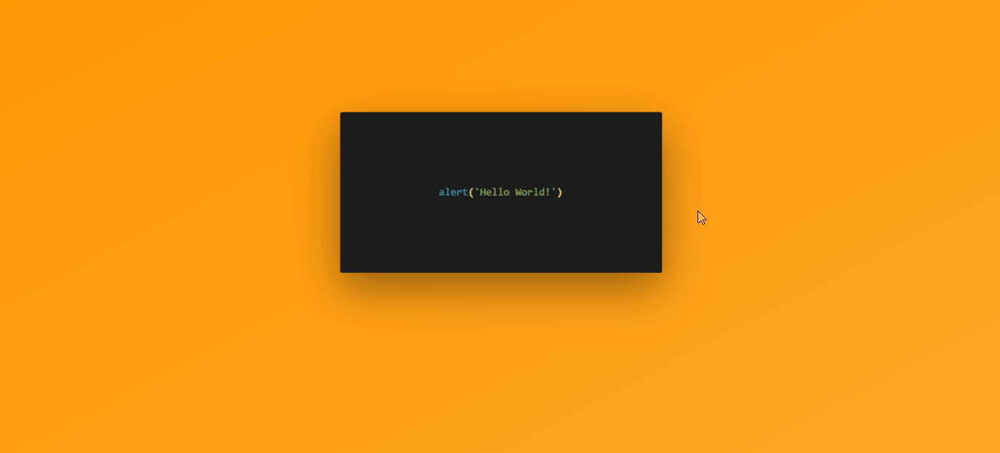
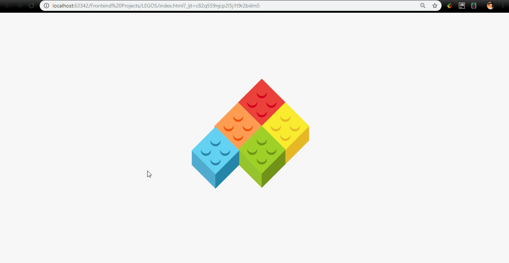
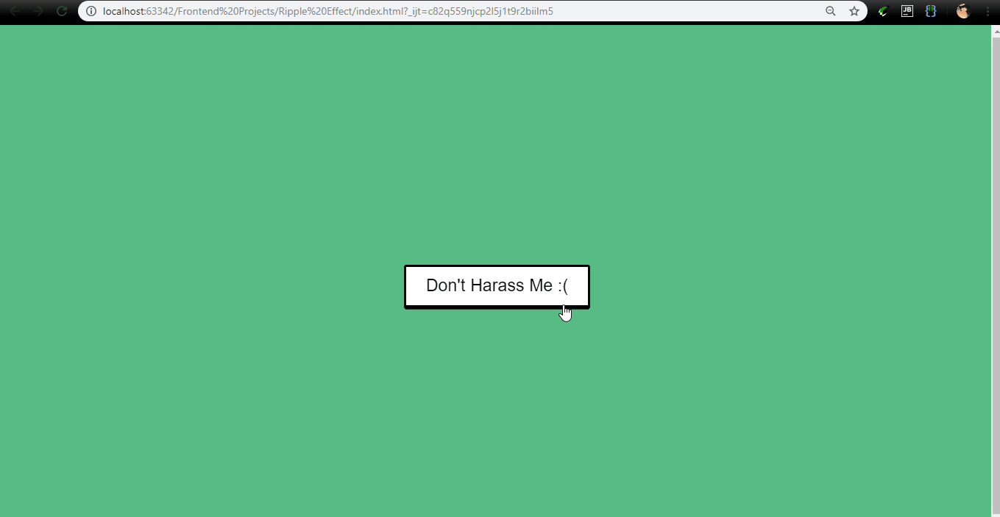
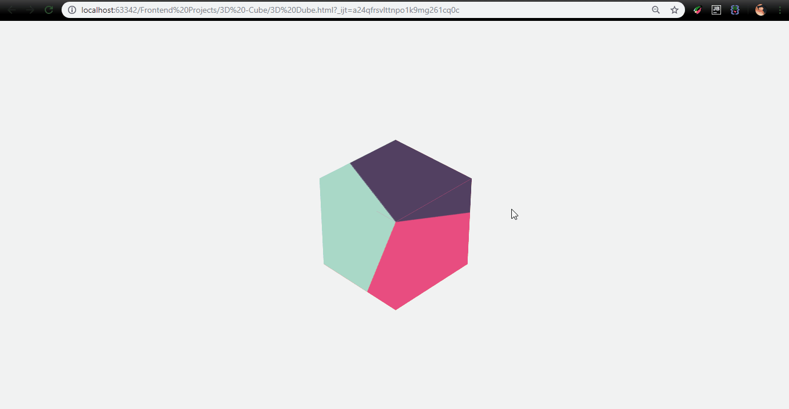

# Frontend-Projects

> ## About Me :grimacing: 
 

   
## [Checkout My Work Here!](https://knifeparty12.github.io/Frontend-Projects/#)

## Current Project Count - [60](https://github.com/KnifeParty12/Frontend-Projects)
  

## Pre-Requisites
[1].HTML advance  
[2].CSS advance(including bootstrap,flexboxes)  
[3].Basic SASS  
[4].Js and Jquery 

***
### Recent Ones :beginner:

> ### Cracked :wine_glass:
[1]. [HTML](https://github.com/KnifeParty12/Frontend-Projects/blob/master/Cracked%20Text%20Effect/index.html)

 Wrapper Div and 3 span's 

[2]. [CSS](https://github.com/KnifeParty12/Frontend-Projects/blob/master/Cracked%20Text%20Effect/style.css)

Use of <i>Clip-Path</i> and <i>transforms</i> involving text-shadow and glow effects 

***

> ### Legos :game_die:
[1]. [HTML](https://github.com/KnifeParty12/Frontend-Projects/blob/master/LEGOS/index.html)

Used Div's to create Lego pieces along with the 4 dots on each.

[2]. [CSS](https://github.com/KnifeParty12/Frontend-Projects/blob/master/LEGOS/style.css)

Lots and lots of Pseudo Selectors(after,before,nth-child) along with box-shadow and sizing.

[3]. [Js](https://github.com/KnifeParty12/Frontend-Projects/blob/master/LEGOS/script.js)

Used <b>TimelineMax</b> for doing complex sequencing in GSAP, a JavaScript library for high-performance HTML5 animation.Its easy to make complex sequences repeat with TimelineMax and there are plenty of methods and events that give you complete access to all aspects of your animation as shown in the demo below.

***

> ### Ripple Button :white_square_button:

[1]. [SCSS](https://github.com/KnifeParty12/Frontend-Projects/blob/master/LEGOS/style.css)

Lots and lots of Pseudo Selectors(after,before,nth-child) along with box-shadow and sizing.

***

> ### Overlay Menu :newspaper:

[1]. [CSS](https://github.com/KnifeParty12/Frontend-Projects/blob/master/LEGOS/style.css)

Lots and lots of Pseudo Selectors(after,before,nth-child) along with box-shadow and sizing.

[2]. [Js](https://github.com/KnifeParty12/Frontend-Projects/blob/master/LEGOS/script.js)

Used <b>TimelineMax</b> for doing complex sequencing in GSAP, a JavaScript library for high-performance HTML5 animation.Its easy to make complex sequences repeat with TimelineMax and there are plenty of methods and events that give you complete access to all aspects of your animation as shown in the demo below.

***

> ### Cube :fire:

[1]. [SCSS](https://github.com/KnifeParty12/Frontend-Projects/blob/master/LEGOS/style.css)

Lots and lots of Pseudo Selectors(after,before,nth-child) along with box-shadow and sizing.

***
